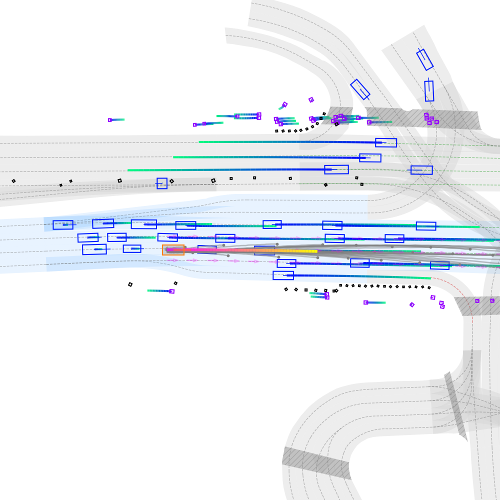

# PLUTO
The visualization from the inference code (`inference.ipynb`)  

<div align="center">
  
</div>

This is the unofficial repository of 

**PLUTO: Push the Limit of Imitation Learning-based Planning for Autonomous Driving**,

[Official repository](https://github.com/jchengai/pluto#),
[Jie Cheng](https://jchengai.github.io/), [Yingbing Chen](https://sites.google.com/view/chenyingbing-homepage), and [Qifeng Chen](https://cqf.io/)


<p align="left">
<a href="https://jchengai.github.io/pluto">

</a>
<a href='https://arxiv.org/abs/2404.14327' style='padding-left: 0.5rem;'>
    
</a>
</p>

## Setup Environment

### Setup dataset

Setup the nuPlan dataset following the [offiical-doc](https://nuplan-devkit.readthedocs.io/en/latest/dataset_setup.html)

### Setup conda environment

```
conda create -n pluto python=3.9
conda activate pluto

# install nuplan-devkit
git clone https://github.com/motional/nuplan-devkit.git && cd nuplan-devkit
pip install -e .
pip install -r ./requirements.txt

# setup pluto
cd ..
git clone https://github.com/jchengai/pluto.git && cd pluto
sh ./script/setup_env.sh
```

## Feature Cache

Preprocess the dataset to accelerate training. It is recommended to run a small sanity check to make sure everything is correctly setup.

```
 python run_training.py \
    py_func=cache +training=train_pluto \
    scenario_builder=nuplan_mini \
    cache.cache_path=/nuplan/exp/sanity_check \
    cache.cleanup_cache=true \
    scenario_filter=training_scenarios_tiny \
    worker=sequential
```

Then preprocess the whole nuPlan training set (this will take some time). You may need to change `cache.cache_path` to suit your condition

```
 export PYTHONPATH=$PYTHONPATH:$(pwd)

 python run_training.py \
    py_func=cache +training=train_pluto \
    scenario_builder=nuplan \
    cache.cache_path=/nuplan/exp/cache_pluto_1M \
    cache.cleanup_cache=true \
    scenario_filter=training_scenarios_1M \
    worker.threads_per_node=40
```

## Training

(The training part it not fully tested)

Same, it is recommended to run a sanity check first:

```
CUDA_VISIBLE_DEVICES=0 python run_training.py \
  py_func=train +training=train_pluto \
  worker=single_machine_thread_pool worker.max_workers=4 \
  scenario_builder=nuplan cache.cache_path=/nuplan/exp/sanity_check cache.use_cache_without_dataset=true \
  data_loader.params.batch_size=4 data_loader.params.num_workers=1
```

Training on the full dataset (without CIL):

```
CUDA_VISIBLE_DEVICES=0,1,2,3 python run_training.py \
  py_func=train +training=train_pluto \
  worker=single_machine_thread_pool worker.max_workers=32 \
  scenario_builder=nuplan cache.cache_path=/nuplan/exp/cache_pluto_1M cache.use_cache_without_dataset=true \
  data_loader.params.batch_size=32 data_loader.params.num_workers=16 \
  lr=1e-3 epochs=25 warmup_epochs=3 weight_decay=0.0001 \
  wandb.mode=online wandb.project=nuplan wandb.name=pluto
```

- add option `model.use_hidden_proj=true +custom_trainer.use_contrast_loss=true` to enable CIL.

- you can remove wandb related configurations if your prefer tensorboard.


## Checkpoint

Download and place the checkpoint in the `pluto/checkpoints` folder.

| Model            | Download |
| ---------------- | -------- |
| Pluto-1M-aux-cil | [OneDrive](https://hkustconnect-my.sharepoint.com/:u:/g/personal/jchengai_connect_ust_hk/EaFpLwwHFYVKsPVLH2nW5nEBNbPS7gqqu_Rv2V1dzODO-Q?e=LAZQcI)    |


## Run Pluto-planner simulation

Run simulation for a random scenario in the nuPlan-mini split

```
sh ./script/run_pluto_planner.sh pluto_planner nuplan_mini mini_demo_scenario pluto_1M_aux_cil.ckpt /dir_to_save_the_simulation_result_video
```

The rendered simulation video will be saved to the specified directory (need change `/dir_to_save_the_simulation_result_video`).

## Docker 

### Build the docker container
```
docker build -t pluto:dev .
```

### Run GPU container
```
docker run --rm -it --gpus all \
  -v "$PWD:/workspace" \
  -v pluto_venv:/opt/venv \
  -v pluto_pip_cache:/root/.cache/pip \
  -w /workspace \
  pluto:dev
```

### Install dependencies inside the container (one-time per `pluto_venv` volume)

This repo expects both **PLUTO deps** and **nuplan-devkit** to be available in the same Python environment.
The commands below are the known-good setup for running the mini demo simulation + rendering a video.

Inside the container:

```
source /opt/venv/bin/activate

# Hydra/omegaconf + old requirement metadata compatibility
python -m pip install --no-cache-dir "pip==24.0"

# Keep legacy deps working (wandb 0.14.x, etc.)
pip install --no-cache-dir --force-reinstall "setuptools<81"
pip install --no-cache-dir "numpy==1.23.4"

# Torch + NATTEN (CUDA 11.8)
pip uninstall -y natten torch torchvision || true
pip install --no-cache-dir \
  torch==2.0.0 torchvision==0.15.1 \
  --index-url https://download.pytorch.org/whl/cu118
pip install --no-cache-dir --force-reinstall natten==0.14.6 \
  --trusted-host shi-labs.com \
  -f https://shi-labs.com/natten/wheels/cu118/torch2.0.0/index.html

# PLUTO python deps
pip install -r /workspace/requirements.txt

# Video writer
pip install imageio imageio-ffmpeg

# nuplan-devkit (clone it under /workspace first if you don't have it)
pip install -r /workspace/nuplan-devkit/requirements.txt
pip install -e /workspace/nuplan-devkit
```

### Run the mini demo simulation (with `nuplan-mini-sample`)

Inside the container:

```
export PYTHONPATH=/workspace:$PYTHONPATH

# Dataset paths (for nuplan-mini-sample layout)
export NUPLAN_DATA_ROOT=/workspace/nuplan-mini-sample/nuplan_data
export NUPLAN_MAPS_ROOT=/workspace/nuplan-mini-sample/nuplan_data/maps

# Use the single DB file (recommended)
export NUPLAN_DB_FILES=/workspace/nuplan-mini-sample/nuplan_data/nuplan-v1.1/splits/mini/2021.05.12.22.00.38_veh-35_01008_01518.db

# Render a video to /workspace/sim_out_video
sh ./script/run_pluto_planner.sh pluto_planner nuplan_mini mini_demo_scenario pluto_1M_aux_cil.ckpt /workspace/sim_out_video
```

## Citation

[Official repository](https://github.com/jchengai/pluto#)

```bibtex
@article{cheng2024pluto,
  title={PLUTO: Pushing the Limit of Imitation Learning-based Planning for Autonomous Driving},
  author={Cheng, Jie and Chen, Yingbing and Chen, Qifeng},
  journal={arXiv preprint arXiv:2404.14327},
  year={2024}
}
```
